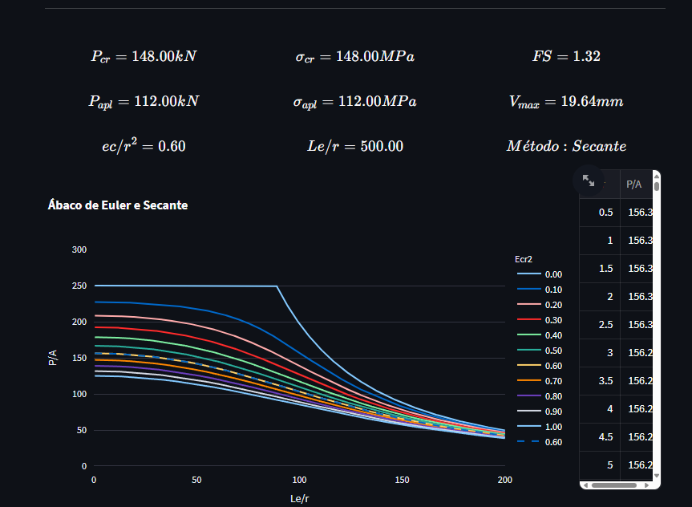

# Calculadora de Tensão Crítica de Flambagem

Este projeto disponibiliza uma calculadora para determinar a **tensão crítica de flambagem** utilizando o **método da secante** e a **equação de Euler** quando não há excentricidade. A aplicação foi desenvolvida para a disciplina de **Resistência dos Materiais 4 (UERJ)** e está disponível para uso no navegador através do **Streamlit**: [Acessar Aplicação](https://calculadora-tensao-critica.streamlit.app/).

## Funcionalidades

- Cálculo da **tensão crítica de flambagem** usando o **método da secante**.
- Aplicação da **equação de Euler** para casos sem excentricidade.
- Verificação de parâmetros geométricos e estruturais para evitar erros de entrada.
- Interface interativa para inserção de dados estruturais, como área, raio de giração, momento de inércia, comprimento efetivo, e excentricidade.
- Cálculo automatizado do **fator de segurança** (FS).
- Gráficos e resultados detalhados da análise de flambagem.

## Demonstração

Acesse a aplicação diretamente no seu navegador:
👉 [Calculadora de Tensão Crítica de Flambagem](https://calculadora-tensao-critica.streamlit.app/)



## Como Funciona

1. **Entrada de Parâmetros**:

   - **Módulo de Elasticidade (E)**: Definido pelo material.
   - **Área da Seção Transversal (A)**: Área da seção do elemento sob análise.
   - **Raio de Giração (r)**: Raio de giração da seção transversal.
   - **Momento de Inércia (I)**: Momento de inércia da seção transversal.
   - **Excentricidade (e)**: Excentricidade da carga aplicada (quando for relevante).
   - **Comprimento Efetivo (Le)**: Comprimento de flambagem da estrutura.

2. **Método da Secante**:

   - Se houver excentricidade, a aplicação usa o método da secante para calcular a tensão crítica.

3. **Equação de Euler**:

   - Se não houver excentricidade, o cálculo segue a fórmula clássica de Euler para flambagem.

4. **Resultados**:
   - A aplicação calcula a **tensão crítica**, **fator de segurança (FS)**, o ábaco completo e algumas outras métricas úteis. Retornando o valor diretamente para o usuário.

## Instalação Local

Se você quiser rodar a calculadora localmente, siga os passos abaixo:

### Pré-requisitos

- Python 3.8 ou superior
- Bibliotecas necessárias listadas no arquivo `requirements.txt`

### Passos para Rodar Localmente

1. Clone o repositório:

   ```bash
   git clone https://github.com/marcelogcardozo/calculadora-tensao-critica.git
   ```

2. Acesse o diretório do projeto:

   ```bash
   cd calculadora-tensao-critica
   ```

3. Instale as dependências:

   ```bash
   pip install -r requirements.txt
   ```

4. Execute a aplicação:

   ```bash
   streamlit run app.py
   ```

## Aplicações e Uso

Esta calculadora é amplamente utilizada para análise estrutural, especialmente em:

- Determinação da tensão crítica de flambagem de colunas em edifícios e pontes.
- Avaliação de segurança estrutural de membros sujeitos a compressão.
- Projetos de engenharia civil e mecânica, onde o dimensionamento de elementos sujeitos à flambagem é crucial.

## Tecnologias Utilizadas

- **Python**: Para cálculo numérico e manipulação de dados.
- **Streamlit**: Para a criação de uma interface de usuário simples e interativa.
- **Numpy**: Para operações matemáticas.
- **Scipy**: Para resolução numérica de equações (método da secante).
- **Matplotlib / Plotly**: Para visualização gráfica dos resultados.
